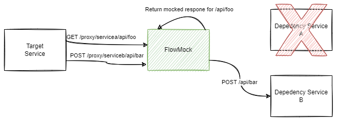

# FlowMock

> Warning: This is a work in progress.

A flow-based high performance programmable HTTP mocker and proxy.  It is designed to enable testing of difficult to setup scenarios or to support/replace 3rd party sandbox environments in pre-production environment.

## Features

- [x] Visually define mock behavior using a flow-based programming model.
- [x] Pass-through proxy with logging.
- [ ] Intuitively convert requests in logs into mocks.
- [x] Complex trigger condition for mocks.
- [ ] Templatable response using placeholder variables.
- [x] Single instance can handle mocking multiple endpoints.
- [ ] Adaptable database backend for persistence.
- [x] FlowMock Admin Portal (FAP) with backing admin API.
- [ ] Extensible hooks for almost everything.

## Typical Usage

### To Support A Resilient Test Environment

#### The Problem

The diagram depicts a typical pre-production environment.  Here, we have a target service with two dependency services A and B.  If service A or B goes down, than the target service is unusable.

This typically happens if service A or B is owned by a different team in the organization, or if the service is provided by a 3rd party.

#### The Solution with FlowMock

FlowMock is designed to run in the environment as a dedicated service.  It acts as a proxy between the target service and its dependencies.  A single instance of FlowMock can route traffic to multiple services.

In the diagram above, FlowMock is configured to route path `/proxy/servicea/api/foo` to service A's `/api/foo` and `/proxy/serviceb/api/bar` to service B's `/api/bar`.  Target service is configured to use the FlowMock endpoints.

FlowMock can now mock responses back to the target service by configuring rules.  This can be based on data in the request payload or FlowMock state such as request iteration or environment variables.

In the diagram above, mocks has been setup for service A.  Target service requests to service A are no longer proxied and if service A goes down, target service remains up.

## Usage

1. Run FlowMock as a service in pre-production environments.
2. Add proxy mapping to a target service's dependency endpoint to FlowMock.
3. Replace dependency endpoint in target service with FlowMock.
4. Now all traffic from target service is flowing through FlowMock.
5. Fire off an integration test or operation to mock against the target service.
6. Using the FlowMock Admin Portal (FAP), review logs in the proxy logger and select a request/response entry to convert to a mock.
7. Define the trigger condition for the mock using the flow editor.  Conditions can be as simple as no condition, i.e. always on and conditionally settable by the Admin API.  Or for more complex scenarios, based on data in the request url/header/body and/or FlowMock environment state such as request iteration, or environment variables.
8. Traffic is now mocked when the condition is met and pass-through proxy continues to handle the rest of the traffic.
9. Repeat step 6-8 until all requests are mocked.

## Installation

FlowMock is designed to be a long running service in an environment.  It is available as a Docker image:

https://hub.docker.com/r/vornet1/flowmock

## Settings
Proxy can be configured on the Settings page.

All proxy requests must be routed through a base path such as `/proxy`.  This is configurable and depicted in the above screenshot.

Individual proxy service mappings can be configured under Proxy Mappings.  In the above example, `/proxy/chucknorris` is mapped to `https://api.chucknorris.io`.  As an example, FlowMock will route `/proxy/chucknorris/foo?id=25` to `https://api/chucknorris.io/foo?id=25`.
